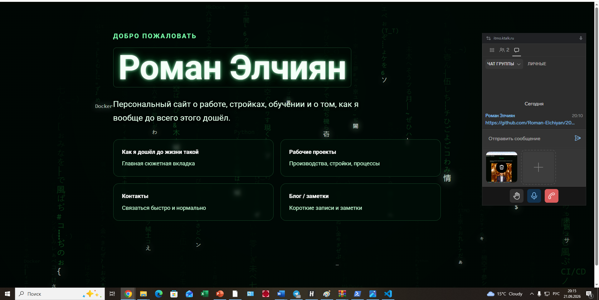
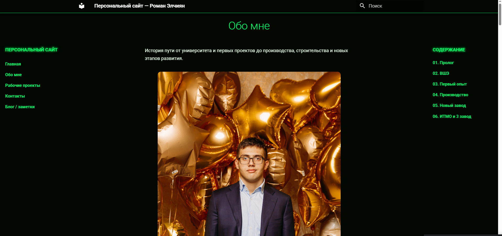
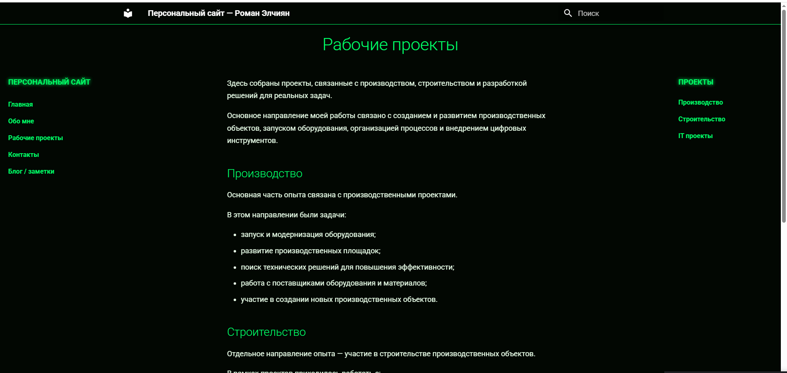
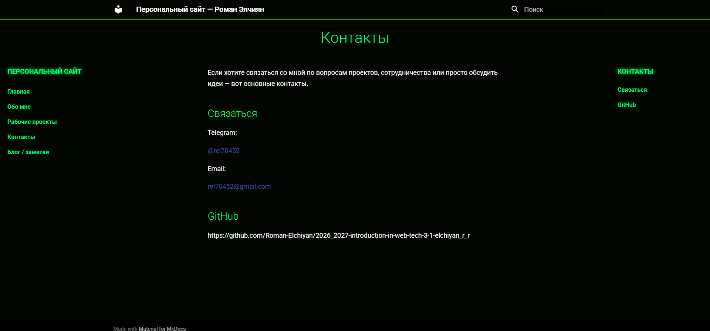
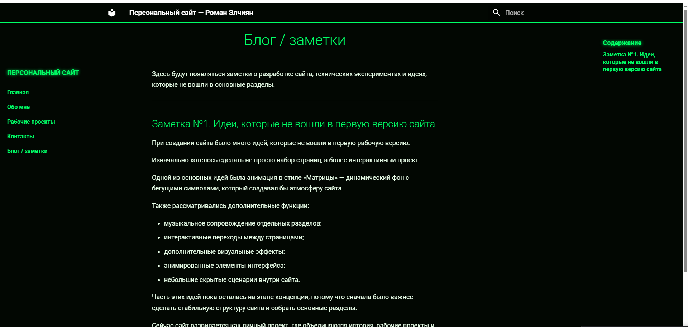

University: ITMO  
Faculty: FICT  
Course: Введение в веб технологии  
Year: 2025/2026  
Group: 3-1  
Author: Эльчиян Р. Р.  
Work: Coursework  
Date of create: 21.09.2026  
Date of finished: 21.09.2026

# Курсовая работа. Создание персонального сайта с использованием MkDocs

## Цель работы

Создать персональный сайт на MkDocs, настроить тему Material и навигацию, добавить страницы с информацией об авторе и проектах, оформить сайт с помощью Markdown, CSS и JavaScript и настроить публикацию через GitHub Pages.

## 1. Подготовка проекта

Для работы сайта используются Python, MkDocs и тема Material for MkDocs.

Установка компонентов:

```powershell
python --version
python -m pip install mkdocs
python -m pip install mkdocs-material
python -m mkdocs --version
```

`python --version` проверяет установленную версию Python. Две следующие команды устанавливают MkDocs и тему Material. Последняя команда подтверждает, что MkDocs доступен для запуска.

Первоначальное создание проекта выполняется командами:

```powershell
mkdir coursework
cd coursework
python -m mkdocs new .
```

После `mkdocs new` создаются файл конфигурации `mkdocs.yml` и каталог `docs` для страниц сайта.

Основная структура проекта:

```text
coursework/
├── docs/
│   ├── index.md
│   ├── story.md
│   ├── projects.md
│   ├── experiments.md
│   ├── now.md
│   ├── contacts.md
│   ├── blog/
│   │   └── index.md
│   └── assets/
│       ├── data/
│       ├── images/
│       ├── javascripts/
│       ├── stylesheets/
│       └── videos/
├── tools/
├── .github/workflows/deploy.yml
└── mkdocs.yml
```

Markdown-файлы содержат текст страниц. Каталог `assets` используется для стилей, JavaScript, изображений, видео и данных Matrix-анимации. В `tools` находятся Python-скрипты подготовки стартовых сцен.

## 2. Настройка MkDocs

В корневом файле `mkdocs.yml` указаны название, описание, автор и адрес сайта. Также подключена тема Material с русским языком интерфейса.

```yaml
site_name: Персональный сайт — Роман Элчиян
site_description: "Персональный сайт в рамках курса «Введение в веб технологии»"
site_author: "Эльчиян Роман Романович"
site_url: "https://roman70452.github.io/2026_2027-introduction-in-web-tech-3-1-elchiyan_r_r/"

theme:
  name: material
  language: ru

nav:
  - Главная: index.md
  - Как я дошёл до жизни такой: story.md
  - Рабочие проекты: projects.md
  - Сейчас: now.md
  - Контакты: contacts.md
  - Блог / заметки: blog/index.md

extra_css:
  - assets/stylesheets/site.css
  - assets/stylesheets/matrix.css
  - assets/stylesheets/story.css

extra_javascript:
  - assets/javascripts/matrix.js
```

Блок `nav` задаёт порядок страниц в меню. Через `extra_css` подключены общие стили, оформление Matrix-анимации и страницы с историей. Через `extra_javascript` подключён файл `matrix.js`.

## 3. Создание страниц

### Главная страница

Главная страница находится в `docs/index.md`. Стандартная боковая навигация и оглавление на ней скрыты с помощью параметров в начале файла:

```yaml
---
hide:
  - navigation
  - toc
---
```

Основная часть страницы состоит из холста для анимации, имени автора, короткого описания и карточек со ссылками на разделы.

```html
<div class="matrix-hero">
  <canvas id="matrix-canvas" aria-hidden="true"></canvas>

  <div class="matrix-overlay">
    <p class="matrix-eyebrow">ДОБРО ПОЖАЛОВАТЬ</p>
    <h1 class="matrix-title">Роман Элчиян</h1>

    <p class="matrix-lead">
      Персональный сайт о работе, стройках, обучении, экспериментах,
       и о том, как я вообще до всего этого дошёл.
    </p>

    <div class="home-links">
      <a class="home-link-card" href="story/">
        <span class="home-link-title">Как я дошёл до жизни такой</span>
        <span class="home-link-text">Главная сюжетная вкладка</span>
      </a>

      <a class="home-link-card" href="projects/">
        <span class="home-link-title">Рабочие проекты</span>
        <span class="home-link-text">Производства, стройки, процессы</span>
      </a>

      <a class="home-link-card" href="contacts/">
        <span class="home-link-title">Контакты</span>
        <span class="home-link-text">Связаться быстро и нормально</span>
      </a>

      <a class="home-link-card" href="blog/">
        <span class="home-link-title">Блог / заметки</span>
        <span class="home-link-text">Короткие записи и заметки</span>
      </a>
    </div>
  </div>
</div>
```

`canvas` служит отдельным слоем для отрисовки Matrix-анимации. Текст и ссылки остаются обычными HTML-элементами и располагаются поверх него.

### Страница «Как я дошёл до жизни такой»

В `story.md` описаны основные этапы обучения и работы: поступление в НИУ ВШЭ, работа в закупках, производственные задачи, участие в строительстве нового завода и поступление в магистратуру ИТМО.

Для структуры страницы используются заголовки Markdown:

```markdown
# Как я дошёл до жизни такой?

## Пролог
## ВШЭ
## Первый опыт
## Производство: теория закончилась
## Новый завод
## Стройка
## Завершение этапа
## Послание от руководства
## ИТМО
## Что осталось после этого пути
```

На странице применены абзацы, маркированные списки, цитаты и выделение текста.

```markdown
План был понятный:

> Университет → диплом → работа → спокойная взрослая жизнь.

Но потом жизнь решила добавить несколько дополнительных уровней сложности:

- ковид;
- смену университетов;
- производство;
- стройки;
- новые проекты;
- увольнения;
- собственные решения.

**Как я вообще дошёл до этого?**
```

Изображения размещены в отдельных контейнерах, которым назначено общее оформление:

```html
<div class="story-image">
  
</div>
```

Видеозапись подключена с помощью элемента `video`:

```html
<div class="story-video">
  <video controls>
    <source src="/assets/videos/about/10.mp4" type="video/mp4">
  </video>
</div>
```

Атрибут `controls` добавляет стандартные кнопки управления воспроизведением.

### Страница проектов

Страница `projects.md` разделена на три направления: производство, строительство и IT-проекты.

```markdown
# Рабочие проекты

## Производство

- запуск и модернизация оборудования;
- развитие производственных площадок;
- поиск технических решений для повышения эффективности;
- работа с поставщиками оборудования и материалов;
- участие в создании новых производственных объектов.

## Строительство

- подготовка новых площадок;
- взаимодействие с подрядчиками;
- контроль этапов реализации;
- решение технических и организационных вопросов.

## IT проекты

- веб-разработка;
- создание персональных и учебных проектов;
- Docker и контейнеризация;
- CI/CD процессы;
- автоматизация рутинных задач.
```

### Страница контактов

На странице `contacts.md` указаны Telegram, электронная почта и ссылка на репозиторий GitHub.

```markdown
# Контакты

## Связаться

Telegram: @rel70452

Email: [rel70452@gmail.com](mailto:rel70452@gmail.com)

## GitHub

https://github.com/Roman-Elchiyan/2026_2027-introduction-in-web-tech-3-1-elchiyan_r_r
```

### Блог

В `docs/blog/index.md` добавлена первая заметка о разработке сайта и идеях, которые рассматривались во время работы.

```markdown
# Блог / заметки

Здесь будут появляться заметки о разработке сайта, технических экспериментах и идеях, которые не вошли в основные разделы.

## Заметка №1. Идеи, которые не вошли в первую версию сайта

Также рассматривались дополнительные функции:

- музыкальное сопровождение отдельных разделов;
- интерактивные переходы между страницами;
- дополнительные визуальные эффекты;
- анимированные элементы интерфейса;
- небольшие скрытые сценарии внутри сайта.
```

## 4. Дополнительные возможности

### Изображения и видео

Материалы страницы «О себе» хранятся отдельно от текста:

```text
docs/assets/images/about/1.jpg
docs/assets/images/about/2.png
docs/assets/images/about/3.png
...
docs/assets/images/about/11.png
docs/assets/videos/about/10.mp4
```

Такое разделение позволяет заменять изображения и видео без изменения структуры Markdown-страницы.

### Поиск

MkDocs использует стандартный поисковый плагин. Отдельная настройка `plugins` не задана, поэтому поиск подключается автоматически вместе с темой Material. При сборке создаётся файл `site/search/search_index.json`.

### Matrix-анимация

Анимация реализована в `docs/assets/javascripts/matrix.js` с помощью HTML Canvas. Скрипт получает холст по его идентификатору и создаёт двумерный контекст рисования:

```javascript
const canvas = document.getElementById("matrix-canvas");
if (!canvas) return;

const ctx = canvas.getContext("2d", { alpha: false });
if (!ctx) return;
```

При открытии страницы загружается индекс подготовленных сцен. Скрипт старается не выбирать ту же сцену, которая использовалась при предыдущем открытии.

```javascript
const indexUrl = new URL(
  "startup_scene_index.json",
  new URL(tuning.startupSceneUrl, document.baseURI)
);

const response = await fetch(indexUrl);
const index = await response.json();

const previousKey = localStorage.getItem("matrix-startup-last-key-v4");
const alternatives = index.scenes.filter(scene => scene.key !== previousKey);
const selected = randomItem(alternatives.length ? alternatives : index.scenes);
```

После загрузки сцены выполняется первый вызов отрисовки, затем запускается цикл анимации:

```javascript
drawCurrentScene();
previousTime = 0;
animationId = requestAnimationFrame(render);
```

Стартовые данные подготавливаются тремя Python-скриптами:

```powershell
python tools/generate_startup_presets.py
python tools/select_startup_scene.py balanced
python tools/check_startup_presets.py
```

`generate_startup_presets.py` создаёт наборы кандидатов. `select_startup_scene.py` формирует готовые сцены и выбирает резервную сцену. `check_startup_presets.py` проверяет структуру JSON, количество потоков, допустимые координаты и конфликты размещения.

## 5. Стилизация сайта

Главная страница оформлена в тёмно-зелёной цветовой схеме. Холст с анимацией, затемнение и содержимое расположены отдельными слоями.

```css
#matrix-canvas {
  position: absolute;
  top: 0;
  left: 0;
  z-index: 1;
  width: 100%;
  height: 100%;
  display: block;
  pointer-events: none;
}

.matrix-hero::after {
  content: "";
  position: absolute;
  inset: 0;
  z-index: 2;
  background: radial-gradient(
    circle at 50% 30%,
    rgba(0, 25, 10, 0.08),
    rgba(0, 8, 4, 0.22) 55%,
    rgba(0, 4, 2, 0.4) 100%
  );
  pointer-events: none;
}
```

Текстовый блок имеет `z-index: 3`, поэтому находится выше анимации и затемнения. Карточки разделов размещаются с помощью CSS Grid:

```css
.home-links {
  display: grid;
  grid-template-columns: repeat(2, minmax(260px, 1fr));
  gap: 1rem;
  max-width: 1050px;
}

@media (max-width: 800px) {
  .home-links {
    grid-template-columns: 1fr;
  }
}
```

На широком экране отображаются две колонки, на экране шириной до 800 пикселей — одна.

Анимация отключается, если пользователь включил в системе уменьшение движения:

```css
@media (prefers-reduced-motion: reduce) {
  #matrix-canvas {
    display: none;
  }
}
```

## 6. Тестирование и публикация

### Локальный запуск

Для запуска сайта из каталога с `mkdocs.yml` используется команда:

```powershell
python -m mkdocs serve
```

После запуска сайт доступен по адресу:

```text
http://127.0.0.1:8000/
```

### Проверка сборки

Обычная сборка статического сайта выполняется командой:

```powershell
python -m mkdocs build
```

Для дополнительной проверки применена строгая сборка:

```powershell
python -m mkdocs build --strict
```

Строгая сборка корневой конфигурации завершилась успешно:

```text
INFO - Cleaning site directory
INFO - Building documentation to directory: site
INFO - Documentation built in 0.28 seconds
```

Статические HTML-, CSS- и JavaScript-файлы создаются в каталоге `site`.

Данные Matrix-анимации проверены отдельно:

```text
Scene: streams=80, sizes={'large': 10, 'medium': 50, 'small': 20}, phases={'middle': 27, 'early': 26, 'late': 27}, conflicts=0
Ready scenes: 100
Bad offsets: 0
Validation: OK
```

Проверка подтвердила наличие 100 готовых сцен. В выбранной сцене находится 80 потоков, конфликтов размещения и недопустимых смещений не обнаружено.

### Автоматическая публикация

Публикация настроена через GitHub Actions. Workflow находится в `.github/workflows/deploy.yml`.

```yaml
name: Deploy MkDocs site

on:
  push:
    branches:
      - main

permissions:
  contents: write

jobs:
  deploy:
    runs-on: ubuntu-latest

    steps:
      - name: Checkout repository
        uses: actions/checkout@v4

      - name: Setup Python
        uses: actions/setup-python@v5
        with:
          python-version: 3.x

      - name: Install dependencies
        run: pip install mkdocs-material

      - name: Build site
        run: mkdocs build

      - name: Deploy
        uses: peaceiris/actions-gh-pages@v4
        with:
          github_token: ${{ secrets.GITHUB_TOKEN }}
          publish_dir: ./site
```

Workflow запускается после отправки изменений в ветку `main`. Сначала GitHub Actions получает файлы репозитория, устанавливает Python и Material for MkDocs, затем выполняет сборку. Содержимое каталога `site` публикуется в ветку GitHub Pages с помощью `peaceiris/actions-gh-pages`.

## Результат

Создан персональный сайт на MkDocs с темой Material и русским интерфейсом. Настроено меню из семи разделов, добавлены главная страница, рассказ об авторе, проекты, контакты и блог. В содержимом используются заголовки, списки, цитаты, ссылки, изображения и видео.

Главная страница дополнена собственной Matrix-анимацией, адаптивными карточками и отдельными стилями. Стартовые сцены анимации формируются заранее и проходят автоматическую проверку. Сайт успешно собирается командой `mkdocs build --strict`, а публикация в GitHub Pages выполняется автоматически после обновления ветки `main`.


## 7. Скриншоты результата работы

Ниже представлены основные результаты работы сайта после завершения разработки и настройки публикации.

### Главная страница сайта

Главная страница содержит приветственный блок с именем автора, описанием проекта и навигационными карточками основных разделов сайта.



### Раздел «Обо мне»

Страница содержит описание личного пути, этапов обучения, опыта работы и основных этапов развития.



### Раздел «Рабочие проекты»

На странице представлены основные направления проектов: производство, строительство и IT-разработка.



### Раздел «Контакты»

Страница содержит способы связи и ссылку на репозиторий проекта GitHub.



### Раздел «Блог / заметки»

В разделе размещаются дополнительные записи о процессе разработки сайта, экспериментах и идеях, которые не вошли в основные страницы.



