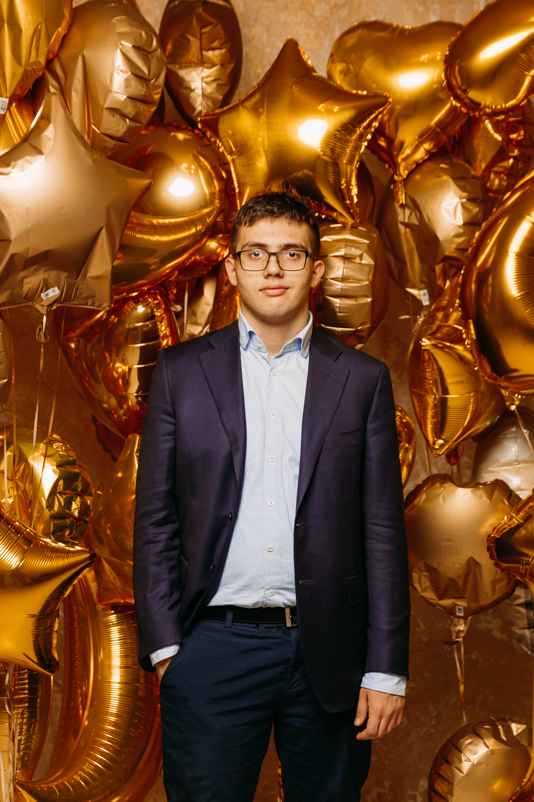
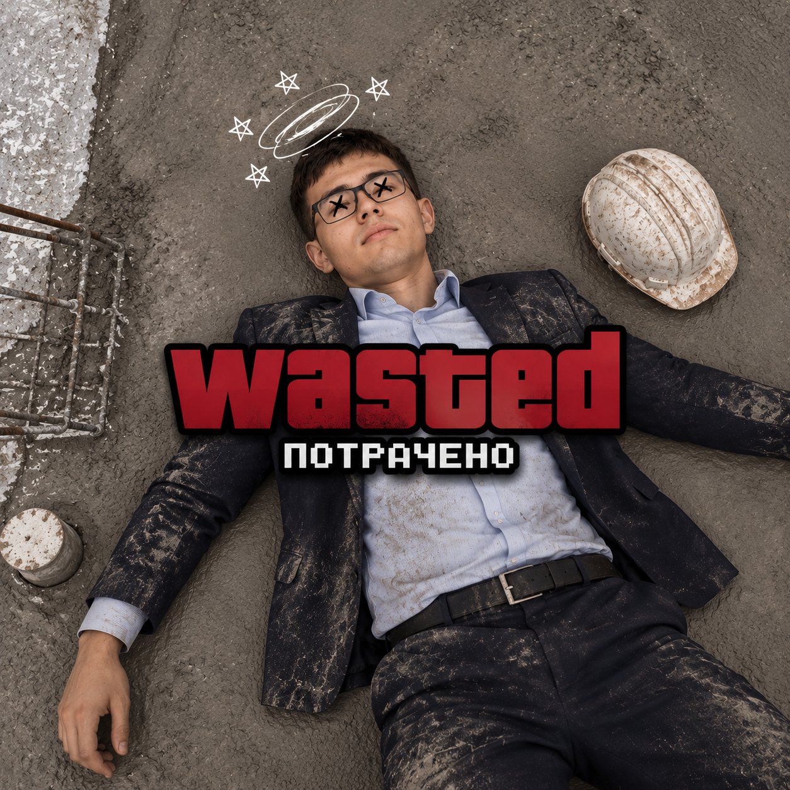
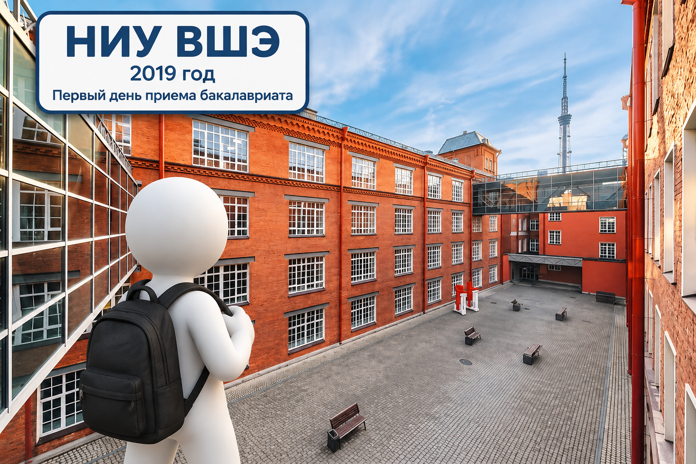
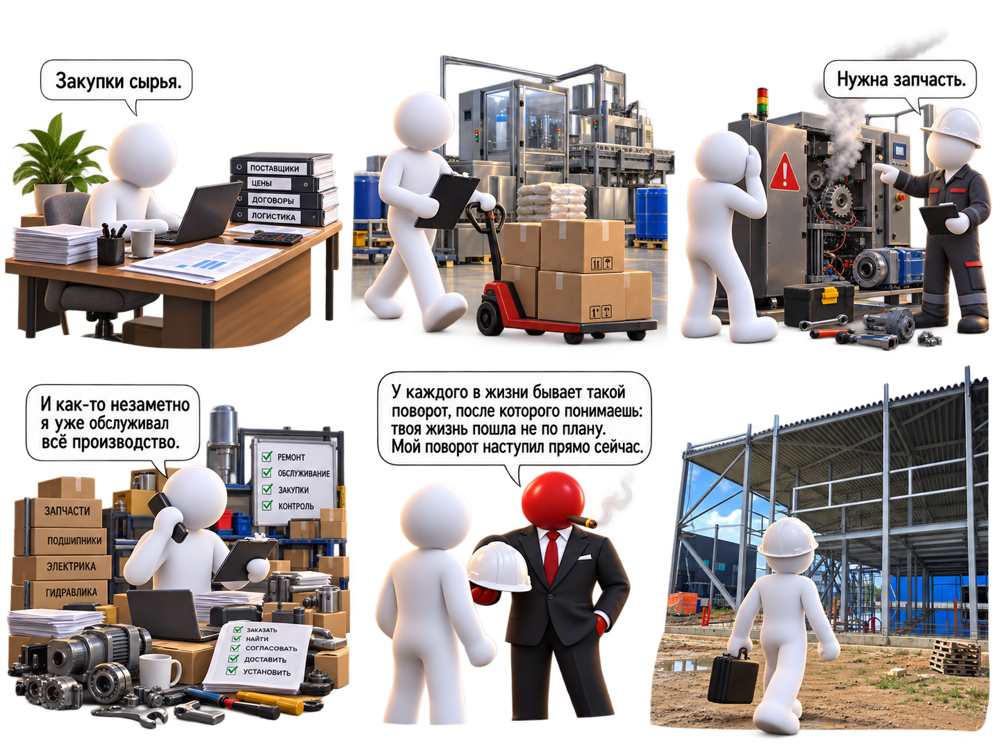
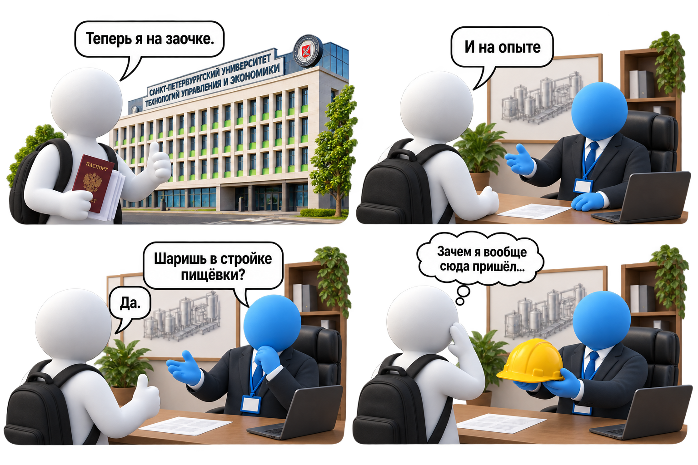
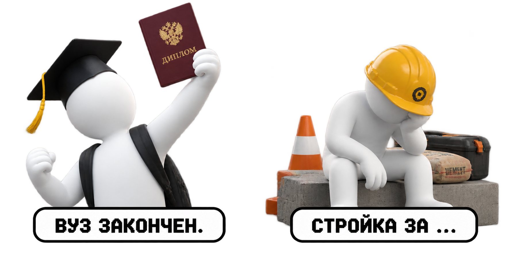
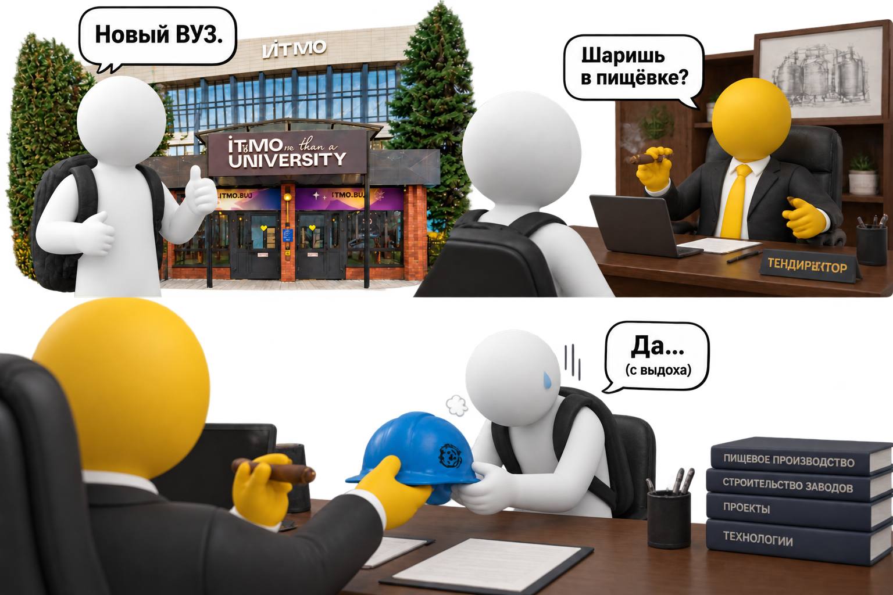

---
hide:
  
---

ПЕРСОНАЛЬНЫЙ САЙТ

<a href="/">
Главная
</a>

<a href="/story/">
Обо мне
</a>

<a href="/projects/">
Рабочие проекты
</a>

<a href="/contacts/">
Контакты
</a>

<a href="/blog/">
Блог / заметки
</a>

СОДЕРЖАНИЕ

<a href="#как-всё-началось">
01. Пролог
</a>

<a href="#начало-истории">
02. ВШЭ
</a>

<a href="#первый-опыт">
03. Первый опыт
</a>

<a href="#от-закупок-к-производству-и-стройке">
04. Производство
</a>

<a href="#новый-университет-новая-работа-и-снова-стройка">
05. Новый завод
</a>

<a href="#новый-этап">
06. ИТМО и 3 завод
</a>

# Обо мне

История пути от университета и первых проектов до производства, строительства и новых этапов развития.

## Пролог

Если бы в 2019 году мне сказали, что через несколько лет я буду разбираться в производстве, оборудовании, строительстве заводов и управлении высокотехнологичным бизнесом — я бы, скорее всего, не поверил.

План был намного проще:

**университет → диплом → работа → нормальная взрослая жизнь.**

Без каски.

Без стройки.

Без вопросов:

«Почему опять остановилось оборудование?»

Но получилось немного иначе.

---

## Начало истории

В 2019 году я поступил в НИУ ВШЭ на направление **«Международный менеджмент»**.

Тогда всё выглядело максимально логично.

Хороший университет.

Интересная специальность.

Понятный маршрут.

Казалось, что дальше всё будет просто:

учёба → диплом → работа.

---

## Первый опыт

Потом пришёл ковид.

Университет переехал в экран.

Пары, встречи и обсуждения — всё через Zoom.

И постепенно стало понятно, что хочется увидеть, как всё работает за пределами лекций и презентаций.

Так появился первый опыт работы.

---

## От закупок к производству

Начинал я как менеджер по закупкам.

Задачи были понятные:

- сырьё;
- поставщики;
- сроки;
- документы;
- переговоры.

Но производство быстро расширило круг задач.

Постепенно пришлось разбираться в оборудовании, запчастях и технических процессах.

---

## Первый большой поворот

В какой-то момент закончился первый большой этап.

Я ушёл из ВШЭ.

Параллельно закончилась первая работа.

Возникли сложности во взаимодействии с руководством.

В итоге этот этап пришлось закрыть и двигаться дальше.

---

## Новый университет. Новая работа. И снова стройка.

Чтобы совмещать учёбу и работу, я выбрал заочную форму обучения.

Так появился Санкт-Петербургский университет технологий управления и экономики.

Направление:

**Финансовый менеджмент.**

Но была одна проблема.

Я снова попал на стройку.

Хотя я этого не хотел.

---

## Завершение второго этапа

Вторая стройка постепенно подошла к концу.

Завершился ещё один большой проект.

Закончился этап обучения в СПбИТУиЭ.

---

## Послание от шефа

<video controls width="700">
<source src="assets/videos/about/10.mp4" type="video/mp4">
</video>

Перевод с управленческого:

> Объект построен.  
> Задача выполнена.  
> Спасибо за участие.  
> Дальше команда продолжает без вас.

---

## ИТМО и третий завод

После этого начался следующий этап.

Я поступил в ИТМО на программу:

**«Управление высокотехнологичным бизнесом».**

И снова вернулся к производству.

За это время были:

- закупки;
- производство;
- оборудование;
- две стройки;
- запуск объектов;
- работа с разными командами.

А впереди был новый проект — строительство пищевого производства.

---

## Что осталось после этого пути

Если посмотреть назад, маршрут получился необычным.

Я начинал с менеджмента и экономики, а потом постепенно оказался там, где вместо учебных кейсов были реальные производства, оборудование и строительные площадки.

Я увидел производство изнутри и понял, как решения влияют на реальный процесс.

Получил опыт строительства производственных объектов и работы с людьми разных профессий.

Сейчас этот маршрут выглядит так:

**международный менеджмент → финансовый менеджмент → производство → оборудование → стройки → управление высокотехнологичным бизнесом.**

Не самый прямой путь.

Но теперь я понимаю не только, как проект выглядит на бумаге, а как он работает в реальности.
