# Лабораторная работа №1

University: [ITMO University](https://itmo.ru/ru/)  
Faculty: [FICT](https://fict.itmo.ru)  
Course: [Введение в веб технологии](https://itmo-ict-faculty.github.io/introduction-in-web-tech/)  
Year: 2026/2027  
Group: ВвВТ 3.1  
Author: Elchiyan Roman Romanovich  
Lab: Lab1  
Date of create: 04.09.2026  
Date of finished:  

## Основы работы с Docker

### Цель работы

Освоить базовые принципы работы с Docker: создание и запуск контейнеров, работу с образами и томами, управление контейнерами, а также создание собственного Docker-образа с помощью Dockerfile.

### 1. Установка и проверка Docker

После настройки Docker Desktop и WSL 2 была проверена установленная версия Docker и работа Docker Engine.

```bash
docker --version
docker info
```

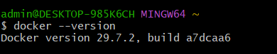

Для проверки запуска контейнеров был использован тестовый образ `hello-world`. После запуска были просмотрены локальные образы, работающие контейнеры и общий список контейнеров.

```bash
docker run hello-world
docker images
docker ps
docker ps -a
```

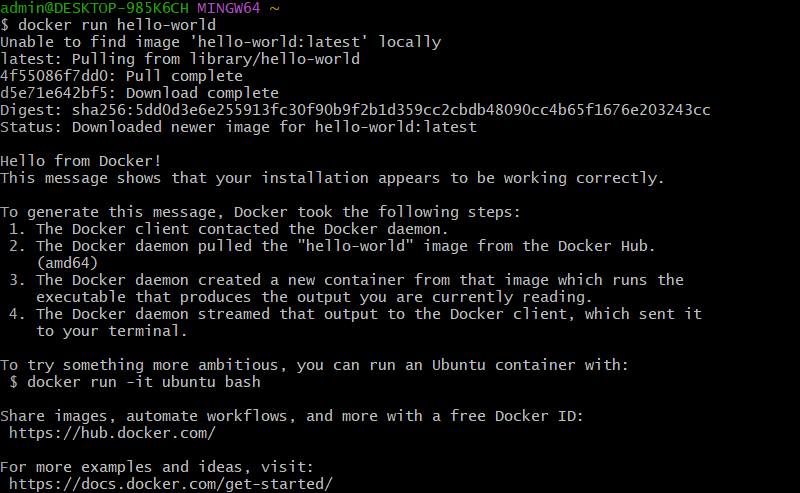

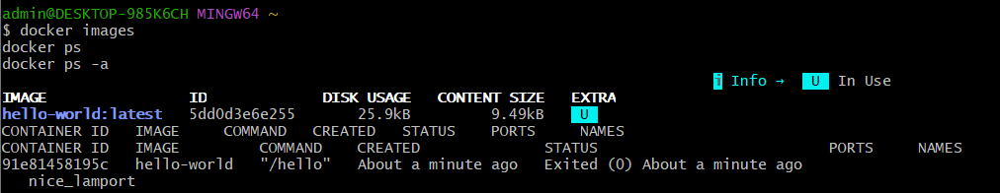

### 2. Работа с готовыми образами

Был загружен образ Ubuntu и запущен интерактивный контейнер. Внутри контейнера установлен `curl`, после чего проверена его версия.

```bash
docker pull ubuntu:latest
docker run -it ubuntu bash
```

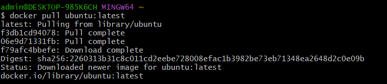

```bash
apt update
apt install -y curl
curl --version
exit
```

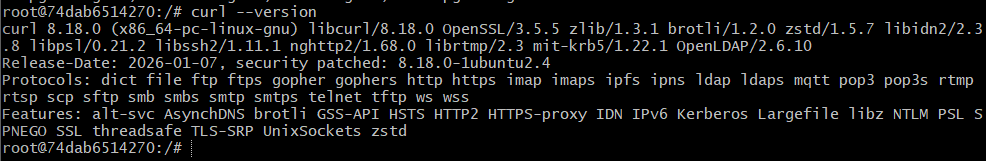

### 3. Запуск веб-сервера nginx

Для запуска веб-сервера использован образ `nginx:alpine`. Контейнер был запущен в фоновом режиме с доступом через порт `8080` на локальном компьютере.

```bash
docker run -d -p 8080:80 --name web-server nginx:alpine
docker ps
```

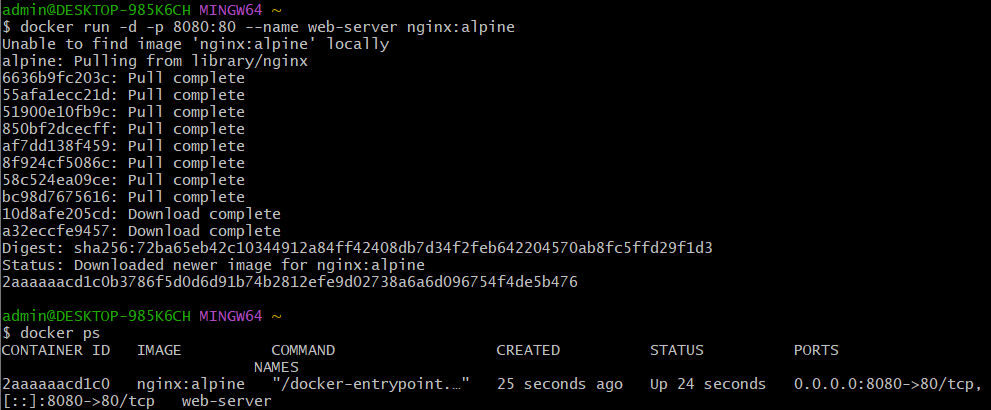

Работа nginx была проверена в браузере по адресу `http://localhost:8080`.

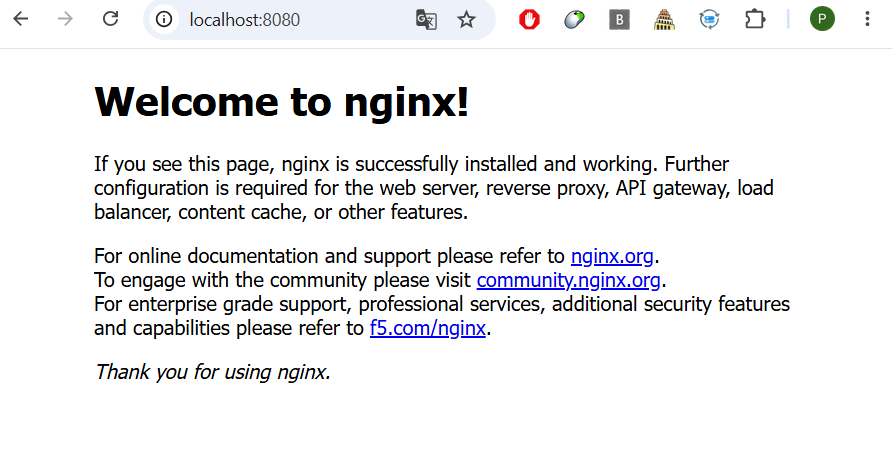

После обращения к серверу были просмотрены его логи. В них зафиксирован успешный запрос к главной странице с кодом ответа `200`.

```bash
docker logs web-server
```

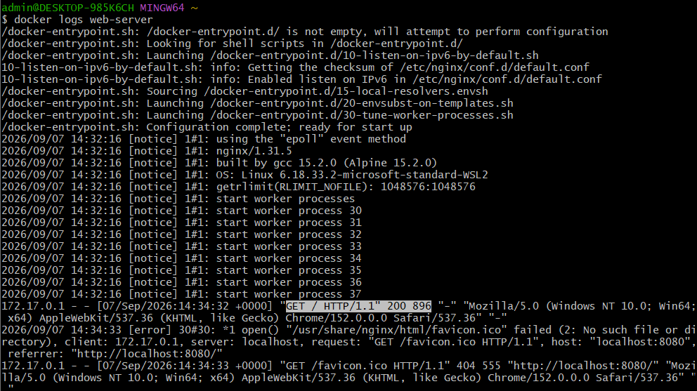

Также было выполнено подключение к работающему контейнеру и просмотр содержимого каталога со стандартными файлами nginx.

```bash
docker exec -it web-server sh
ls /usr/share/nginx/html
exit
```

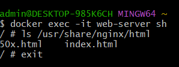

### 4. Управление контейнерами

Контейнер nginx был остановлен, после чего проверено его состояние в списке работающих и всех созданных контейнеров.

```bash
docker stop web-server
docker ps
docker ps -a
```

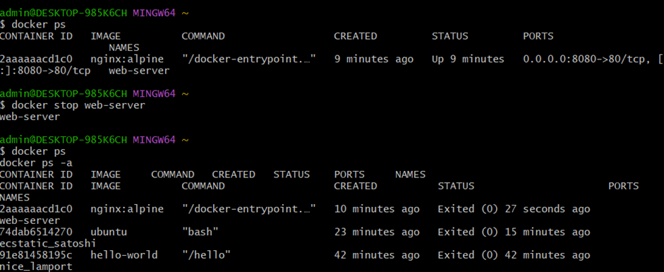

После этого контейнер был повторно запущен, затем остановлен и удалён. В завершение удалён и использованный образ nginx.

```bash
docker start web-server
docker ps
docker stop web-server
docker rm web-server
docker ps -a
docker rmi nginx:alpine
```

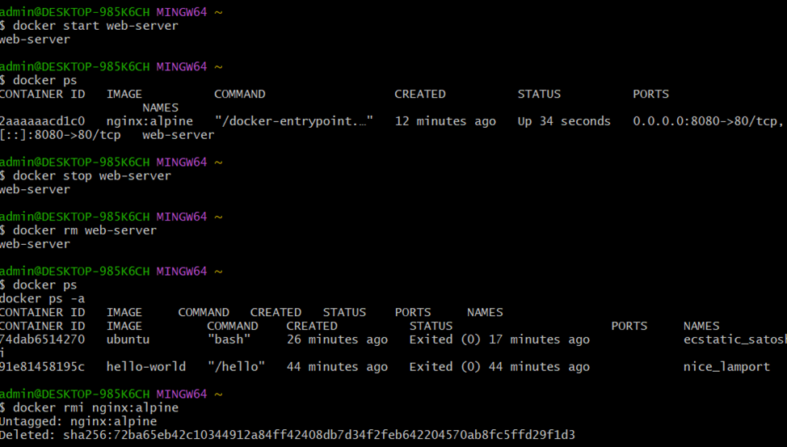

### 5. Работа с томами

Для проверки сохранения данных независимо от контейнера был создан том `my-volume` и подключён к каталогу `/data` внутри Ubuntu-контейнера. В подключённом томе создан файл `test.txt`.

```bash
docker volume create my-volume
docker volume ls
docker run -it --name volume-test -d -v my-volume:/data ubuntu bash
docker exec -it volume-test bash
echo "Hello from volume" > /data/test.txt
cat /data/test.txt
exit
```

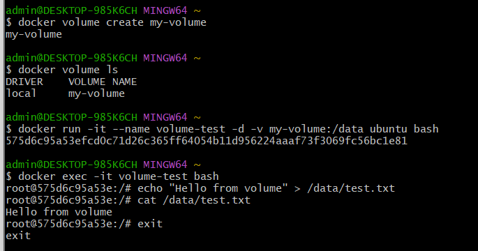

Первый контейнер был удалён, после чего создан новый контейнер с тем же томом. Файл `test.txt` остался доступен, что подтвердило сохранение данных в Docker volume.

```bash
docker rm -f volume-test
docker run -it --name volume-test-2 -d -v my-volume:/data ubuntu bash
docker exec -it volume-test-2 bash
cat /data/test.txt
```

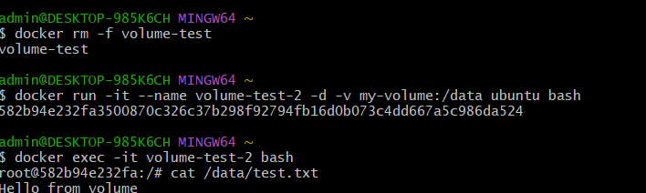


### 6. Создание Dockerfile

Для данной части лабораторной работы было создано  Flask-приложение.

`app.py`:

```python
from flask import Flask
app = Flask(__name__)

@app.route('/')
def hello():
    return "Hello from Docker!"

if __name__ == '__main__':
    app.run(host='0.0.0.0', port=5000)
```

`requirements.txt`:

```text
Flask==2.0.1
Werkzeug==2.0.3
```

Версия `Werkzeug==2.0.3` была добавлена после выявленной несовместимости `Flask==2.0.1` с актуальной версией Werkzeug. Без фиксации версии приложение завершалось с ошибкой импорта `url_quote`.

`Dockerfile`:

```dockerfile
FROM python:3.9-slim

WORKDIR /app

RUN apt-get update && apt-get install -y curl vim

COPY requirements.txt .

RUN pip install --no-cache-dir -r requirements.txt

COPY app.py .

RUN useradd -u 1000 -m appuser

USER appuser

EXPOSE 5000

ENV FLASK_ENV=production

CMD ["python", "app.py"]
```

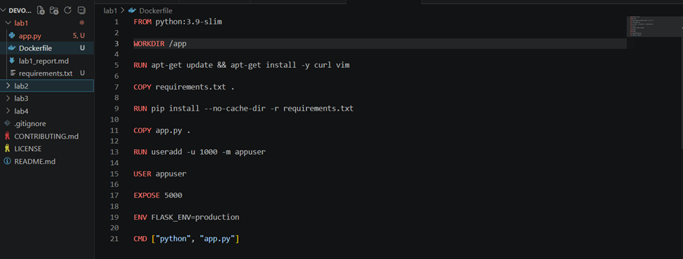

На основе Dockerfile был собран собственный образ `my-flask-app`.

```bash
docker build -t my-flask-app .
docker images
```

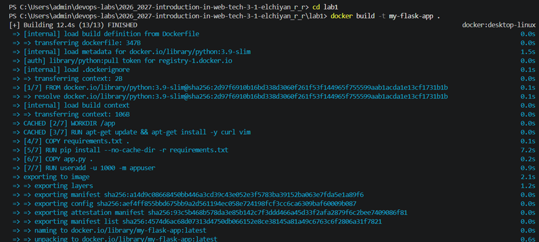
### 7. Сборка и запуск Flask-приложения

Из созданного образа был запущен контейнер `flask-container` с пробросом порта `5000`.

```bash
docker run -d -p 5000:5000 --name flask-container my-flask-app
docker ps
```

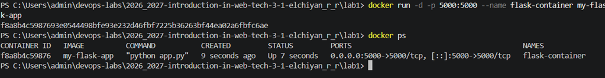

Работа приложения проверена HTTP-запросом к локальному адресу:

```bash
curl http://localhost:5000
```

В ответ получен статус `200 OK` и сообщение:

```text
Hello from Docker!
```

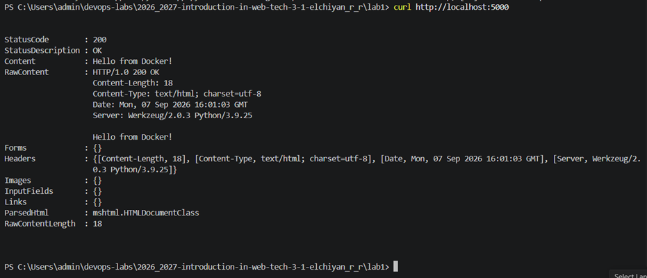

### Вывод

В ходе лабораторной работы были выполнены основные операции с Docker: работа с образами и контейнерами, запуск nginx, управление состоянием контейнеров, использование томов для сохранения данных и сборка собственного образа с Flask-приложением.
