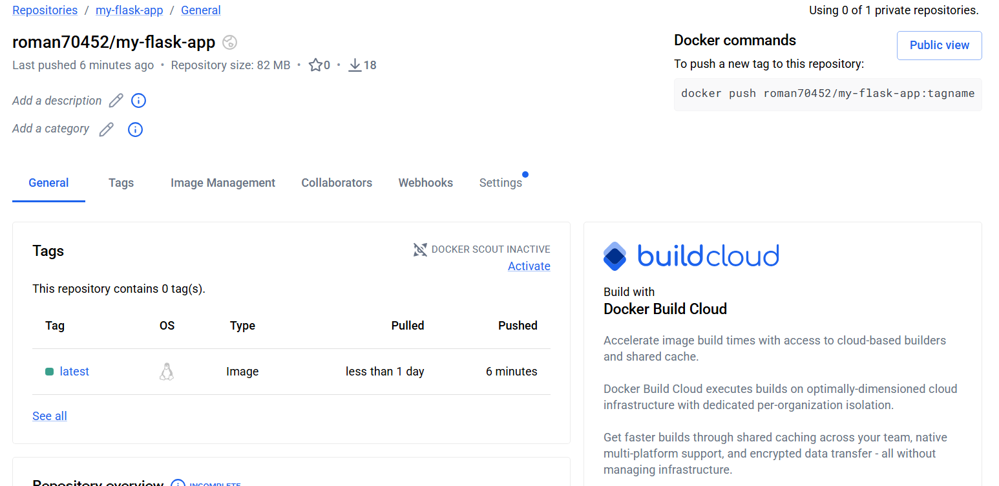
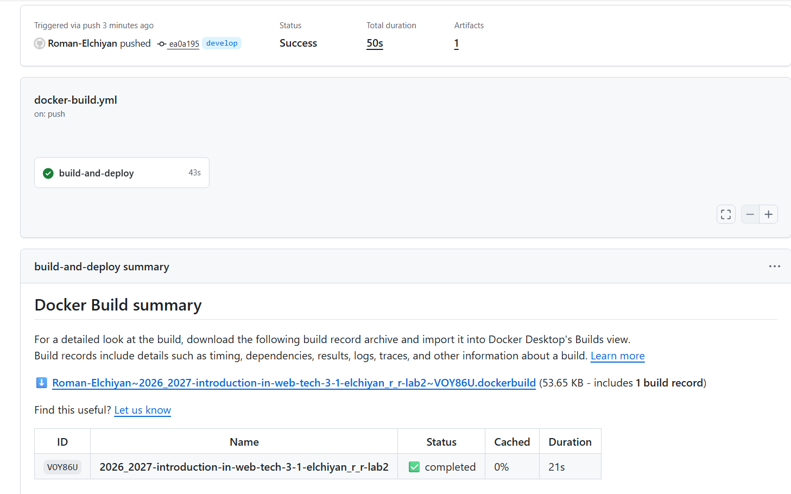
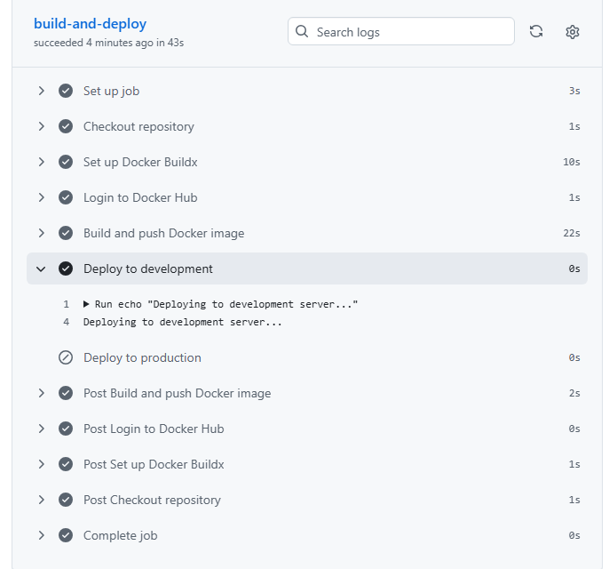
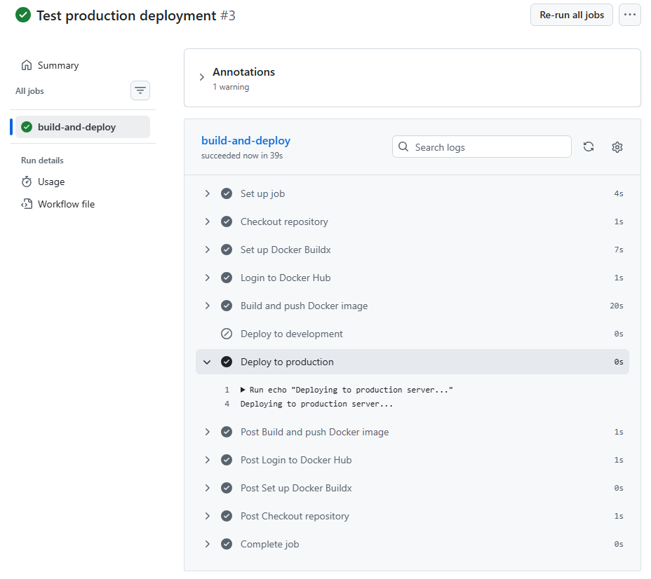
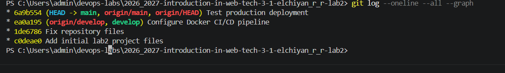

# Лабораторная работа №2
## CI/CD для Docker приложения

**University:** ITMO University  
**Faculty:** FICT  
**Course:** Введение в веб технологии  
**Academic year:** 2026/2027  
**Group:** 3-1  
**Author:** Эльчиян Р. Р.

## Цель работы

Настроить CI/CD-пайплайн с использованием GitHub Actions для автоматической сборки Docker-образа, его публикации в Docker Hub и выполнения разных шагов деплоя в зависимости от ветки репозитория.

В работе используются две ветки:

- `develop` — ветка разработки;
- `main` — production-ветка.

## 1. Подготовка проекта

Для лабораторной работы был создан отдельный GitHub-репозиторий:

```text
2026_2027-introduction-in-web-tech-3-1-elchiyan_r_r-lab2
```

Из первой лабораторной работы были перенесены файлы приложения:

```text
app.py
requirements.txt
Dockerfile
```

Для хранения GitHub Actions workflow была создана директория:

```text
.github/workflows/
```

В ней размещён файл:

```text
docker-build.yml
```

Также была создана ветка разработки:

```bash
git switch -c develop
git push -u origin develop
```

## 2. Репозиторий Docker Hub

Для хранения собранного Docker-образа был создан публичный репозиторий Docker Hub:

```text
roman70452/my-flask-app
```

Итоговый образ публикуется с тегом:

```text
roman70452/my-flask-app:latest
```

После выполнения CI/CD-пайплайна в Docker Hub появился тег `latest`.



*Рисунок 1 — Docker-образ `roman70452/my-flask-app:latest` в Docker Hub.*

## 3. GitHub Secrets

Для авторизации GitHub Actions в Docker Hub используются секреты репозитория:

```text
DOCKER_USERNAME
DOCKER_PASSWORD
```

`DOCKER_USERNAME` содержит имя пользователя Docker Hub, а `DOCKER_PASSWORD` — Personal Access Token Docker Hub.


## 4. Настройка GitHub Actions

Файл `.github/workflows/docker-build.yml` содержит следующий workflow:

```yaml
name: Docker CI/CD

on:
  push:
    branches:
      - main
      - develop

jobs:
  build-and-deploy:
    runs-on: ubuntu-latest

    steps:
      - name: Checkout repository
        uses: actions/checkout@v4

      - name: Set up Docker Buildx
        uses: docker/setup-buildx-action@v3

      - name: Login to Docker Hub
        uses: docker/login-action@v3
        with:
          username: ${{ secrets.DOCKER_USERNAME }}
          password: ${{ secrets.DOCKER_PASSWORD }}

      - name: Build and push Docker image
        uses: docker/build-push-action@v6
        with:
          context: .
          push: true
          tags: ${{ secrets.DOCKER_USERNAME }}/my-flask-app:latest

      - name: Deploy to development
        if: github.ref == 'refs/heads/develop'
        run: echo "Deploying to development server..."

      - name: Deploy to production
        if: github.ref == 'refs/heads/main'
        run: echo "Deploying to production server..."
```

Workflow автоматически запускается при `push` в ветки `main` и `develop`.

Шаг `Checkout repository` загружает код репозитория на runner GitHub Actions.

Шаг `Set up Docker Buildx` настраивает механизм сборки Docker-образов.

Шаг `Login to Docker Hub` выполняет авторизацию в Docker Hub с использованием GitHub Secrets.

Шаг `Build and push Docker image` собирает образ из текущего каталога проекта и публикует его в Docker Hub с тегом `latest`.

## 5. Условный деплой

Для ветки `develop` используется условие:

```yaml
if: github.ref == 'refs/heads/develop'
```

и выполняется команда:

```text
Deploying to development server...
```

Для ветки `main` используется условие:

```yaml
if: github.ref == 'refs/heads/main'
```

и выполняется команда:

```text
Deploying to production server...
```

Таким образом, один workflow используется для двух веток, но шаг деплоя выбирается автоматически в зависимости от текущей ветки.

## 6. Тестирование ветки develop

Настройка CI/CD была зафиксирована в ветке `develop`:

```bash
git add .
git commit -m "Configure Docker CI/CD pipeline"
git push
```

После `push` GitHub Actions автоматически запустил workflow.

Все основные этапы были выполнены успешно.



*Рисунок 2 — Успешный запуск CI/CD-пайплайна для ветки `develop`.*

Для ветки `develop` шаг `Deploy to development` выполнился, а `Deploy to production` был пропущен.

В логе было получено сообщение:

```text
Deploying to development server...
```



*Рисунок 3 — Выполнение шага `Deploy to development` и пропуск production-деплоя.*

## 7. Тестирование ветки main

После проверки ветки `develop` workflow был перенесён в `main`.

Для отдельной проверки запуска production-пайплайна был создан тестовый коммит:

```bash
git commit --allow-empty -m "Test production deployment"
git push
```

Параметр `--allow-empty` позволяет создать коммит без изменения файлов. В данном случае он использовался для повторного запуска CI/CD-пайплайна.

В ветке `main` шаг `Deploy to development` был пропущен, а `Deploy to production` выполнен.

В логе было получено сообщение:

```text
Deploying to production server...
```



*Рисунок 4 — Выполнение шага `Deploy to production` и пропуск development-деплоя.*

## 8. Проверка истории коммитов

Для просмотра истории использовалась команда:

```bash
git log --oneline --all --graph
```

В истории присутствуют, в частности, следующие коммиты:

```text
6a9b554 Test production deployment
ea0a195 Configure Docker CI/CD pipeline
1de6786 Fix repository files
c0deae0 Add initial lab2 project files
```



*Рисунок 5 — История коммитов веток `main` и `develop`.*

## 9. Результат работы

В ходе лабораторной работы был настроен CI/CD-пайплайн на базе GitHub Actions.

При `push` в `main` или `develop` автоматически выполняются:

```text
Получение исходного кода
        ↓
Настройка Docker Buildx
        ↓
Авторизация в Docker Hub
        ↓
Сборка Docker-образа
        ↓
Публикация образа в Docker Hub
        ↓
Проверка текущей ветки
        ↓
develop → development deployment
main    → production deployment
```

В результате:

- Docker-образ автоматически собирается средствами GitHub Actions;
- образ автоматически публикуется в Docker Hub;
- учётные данные Docker Hub хранятся в GitHub Secrets;
- для `develop` выполняется development-деплой;
- для `main` выполняется production-деплой;
- работа условного деплоя проверена отдельными запусками CI/CD.

Итоговый Docker-образ:

```text
roman70452/my-flask-app:latest
```

Цель лабораторной работы достигнута.
