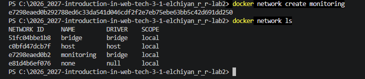
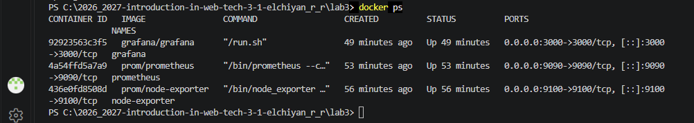
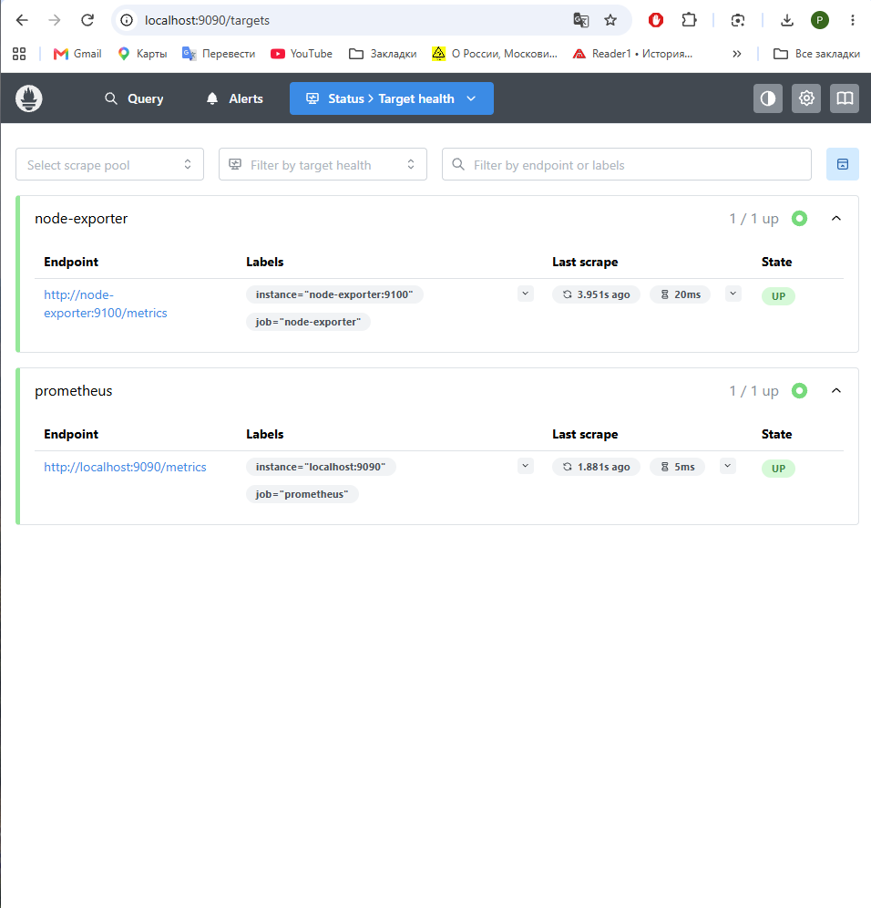
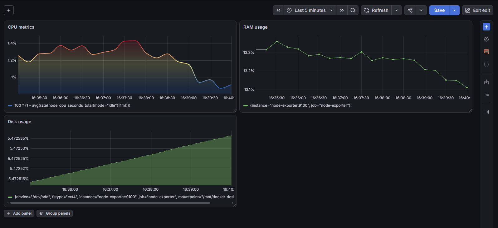
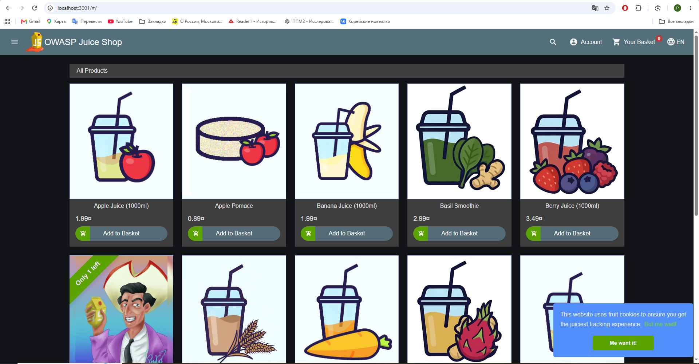
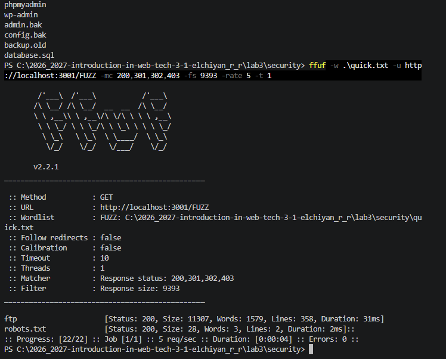
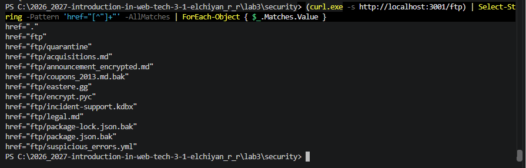
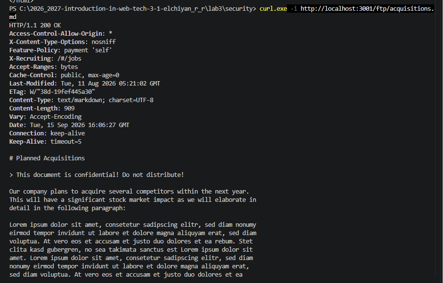

# Лабораторная работа № 3
## Мониторинг и базовый анализ безопасности веб-приложений

**Университет:** Университет ИТМО  
**Факультет:** ФИКТ  
**Курс:** Введение в веб технологии  
**Учебный год:** 2026/2027  
**Группа:** 3-1  
**Автор:** Эльчиян Р. Р.

---

## Цель работы

Развернуть в Docker систему мониторинга на базе Prometheus, Node Exporter и Grafana, настроить сбор и визуализацию системных метрик, а затем выполнить базовый анализ безопасности  веб-приложения OWASP Juice Shop в локальной среде.

## 1. Настройка мониторинга

### 1.1. Создание Docker-сети

Для объединения сервисов мониторинга была создана отдельная пользовательская сеть Docker.

```powershell
docker network create monitoring
docker network ls
```

`docker network create monitoring` создаёт сеть `monitoring`. Команда `docker network ls` выводит список Docker-сетей и позволяет убедиться, что сеть создана.



*Рисунок 1 — Создание Docker-сети `monitoring`.*

### 1.2. Запуск сервисов мониторинга

В сети `monitoring` были запущены три контейнера:

- **Node Exporter** — получает системные метрики;
- **Prometheus** — собирает и хранит метрики;
- **Grafana** — отображает метрики в виде графиков и панелей.

Для проверки запущенных контейнеров использовалась команда:

```powershell
docker ps
```

В результате Grafana была доступна на порту `3000`, Prometheus — на `9090`, Node Exporter — на `9100`.



*Рисунок 2 — Запущенные контейнеры Grafana, Prometheus и Node Exporter.*

### 1.3. Настройка Prometheus

В конфигурации Prometheus был задан интервал сбора метрик 15 секунд и две цели: сам Prometheus и Node Exporter.

```yaml
global:
  scrape_interval: 15s

scrape_configs:
  - job_name: prometheus
    static_configs:
      - targets: ['localhost:9090']

  - job_name: node-exporter
    static_configs:
      - targets: ['node-exporter:9100']
```

Адрес `node-exporter:9100` работает благодаря общей Docker-сети: контейнеры могут обращаться друг к другу по именам.

После запуска Prometheus обе цели на странице **Targets** находились в состоянии `UP`, то есть сбор метрик выполнялся успешно.



*Рисунок 3 — Состояние целей Prometheus.*

### 1.4. Настройка Grafana

Prometheus был добавлен в Grafana как источник данных. Затем был создан дашборд с показателями загрузки процессора, оперативной памяти и дискового пространства.

Примеры запросов:

```promql
100 * (1 - avg(rate(node_cpu_seconds_total{mode="idle"}[1m])))
```

```promql
100 * (1 - (node_memory_MemAvailable_bytes / node_memory_MemTotal_bytes))
```

Первый запрос показывает процент загрузки CPU, второй — долю используемой оперативной памяти.



*Рисунок 4 — Итоговый дашборд системного мониторинга в Grafana.*

Данные поступали в Grafana в реальном времени, что позволило наблюдать изменение нагрузки системы.

## 2. Базовый анализ безопасности OWASP Juice Shop

### 2.1. Запуск учебного приложения

Был загружен Docker-образ OWASP Juice Shop:

```powershell
docker pull bkimminich/juice-shop
```

При первом запуске порт `3000` оказался занят Grafana, поэтому Juice Shop был запущен на локальном порту `3001`:

```powershell
docker run -d --name juice-shop -p 127.0.0.1:3001:3000 bkimminich/juice-shop
```



*Рисунок 5 — OWASP Juice Shop, запущенный локально на порту `3001`.*

### 2.2. Проверка доступных путей

Для поиска доступных путей использовался `ffuf`. Поскольку Juice Shop является одностраничным приложением и может возвращать одинаковую HTML-страницу для разных адресов, ответы стандартного размера были исключены из результата.

```powershell
ffuf -w .\quick.txt -u http://localhost:3001/FUZZ -mc 200,301,302,403 -fs 9393 -rate 5 -t 1
```

Основные параметры команды:

- `-w` — файл со списком проверяемых путей;
- `-u` — адрес с маркером `FUZZ`;
- `-mc` — HTTP-коды, которые нужно отображать;
- `-fs 9393` — исключение стандартных ответов размером 9393 байта;
- `-rate 5` — ограничение частоты запросов;
- `-t 1` — один параллельный поток.

В результате были выделены реальные пути `ftp` и `robots.txt`.



*Рисунок 6 — Результат проверки путей локального OWASP Juice Shop.*

### 2.3. Анализ `robots.txt` и доступ к файлам каталога `/ftp`

Для проверки служебных путей был выполнен запрос к файлу `robots.txt`:

```powershell
curl.exe -i http://localhost:3001/robots.txt
```

В ответе была обнаружена запись:

```text
User-agent: *
Disallow: /ftp
```

Директива `Disallow: /ftp` не запрещает пользователю обращаться к каталогу.

После перехода по адресу `http://localhost:3001/ftp` был обнаружен доступный каталог со списком файлов.

[](images/07_ftp_listing.png)

*Рисунок 7 — Список файлов, доступных в каталоге `/ftp`.*

Для проверки доступа к одному из документов был выполнен запрос:

```powershell
curl.exe -i http://localhost:3001/ftp/acquisitions.md
```

Параметр `-i` выводит HTTP-заголовки вместе с телом ответа.

Сервер вернул статус `HTTP/1.1 200 OK` и содержимое файла `acquisitions.md`. Таким образом, документ из каталога `/ftp` оказался доступен напрямую по HTTP без дополнительной авторизации.

При анализе результата важно учитывать не только HTTP-код ответа. Статус `200 OK` означает, что запрос был успешно обработан, но для подтверждения получения нужного ресурса необходимо также проверить содержимое тела ответа.

[](images/08_exposed_file_response.png)

*Рисунок 8 — Получение файла `acquisitions.md` из каталога `/ftp`.*


## Вывод

В ходе лабораторной работы была развернута система мониторинга **Node Exporter — Prometheus — Grafana** в Docker. Prometheus успешно собирал системные метрики, а Grafana использовалась для отображения загрузки CPU, оперативной памяти и дискового пространства.

Во второй части был локально запущен OWASP Juice Shop и выполнен базовый анализ доступных ресурсов. Проверка показала, что `robots.txt` может раскрывать интересующие пути, а размещение служебных файлов в открытом каталоге `/ftp` приводит к раскрытию информации. Также было подтверждено, что для оценки результата проверки недостаточно учитывать только HTTP-код ответа — необходимо анализировать его фактическое содержимое.
